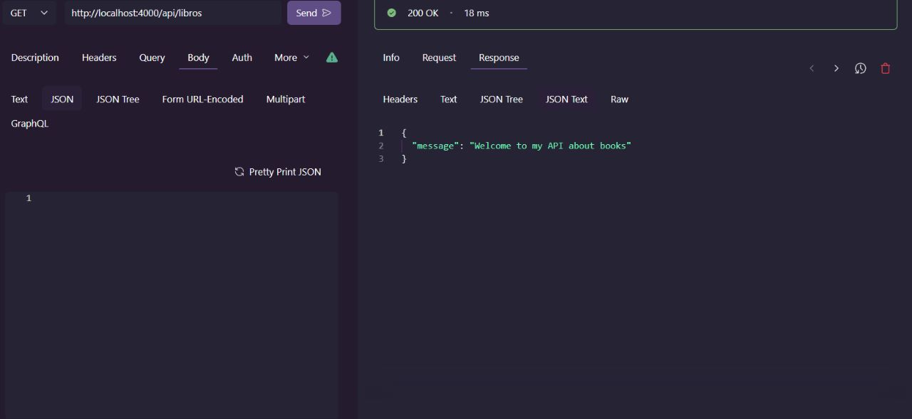
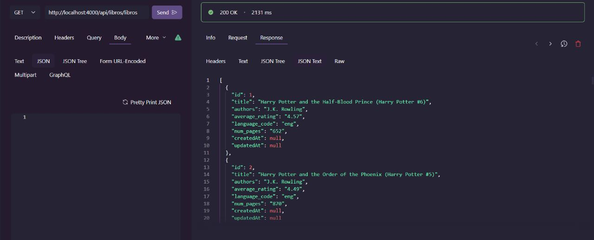
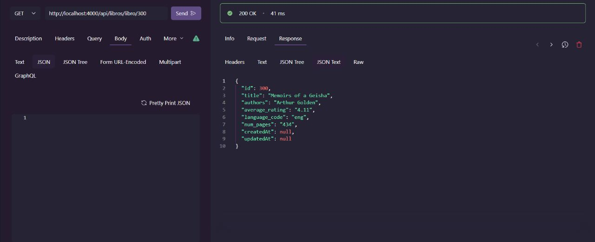
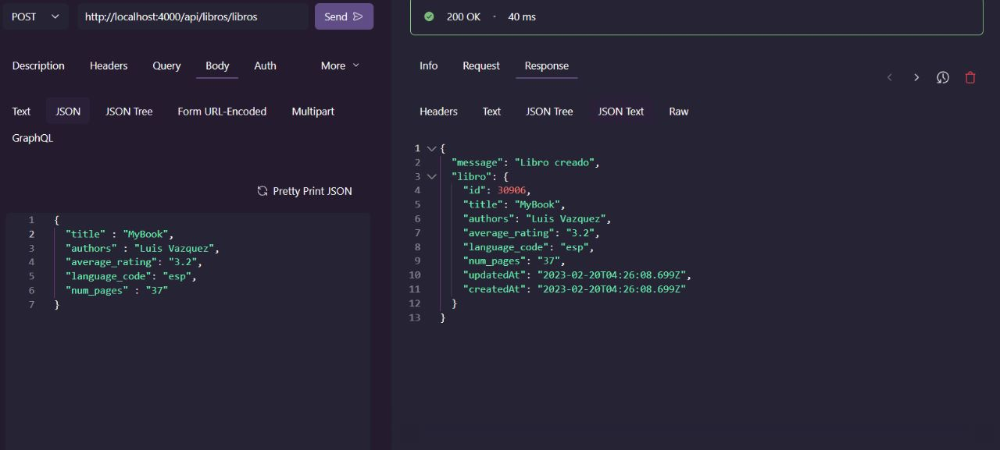
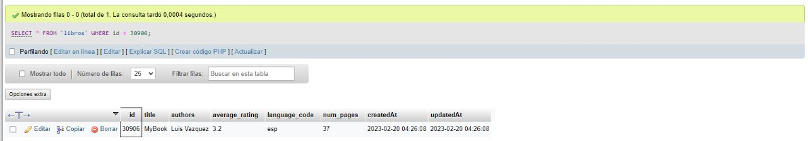
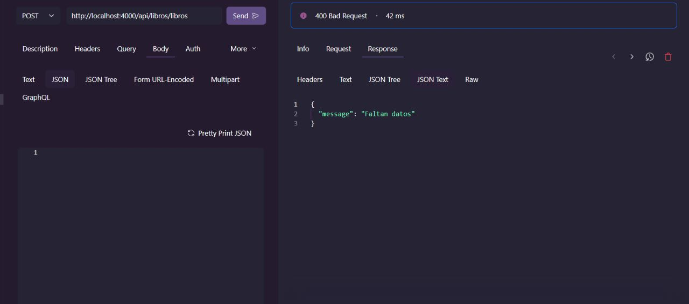
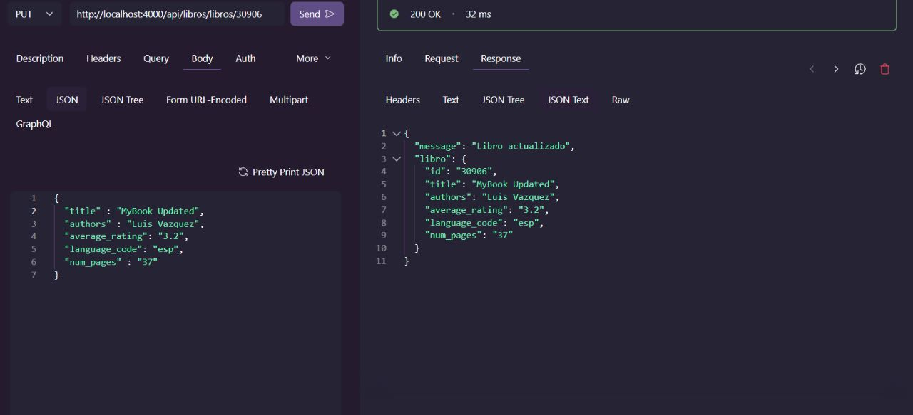
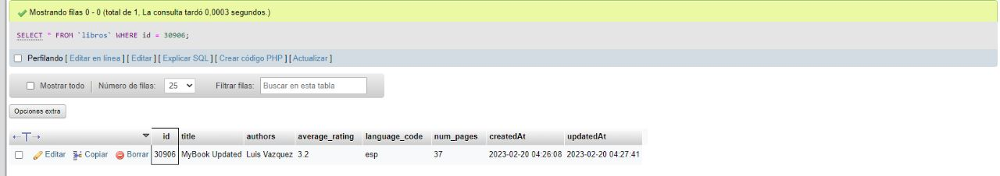
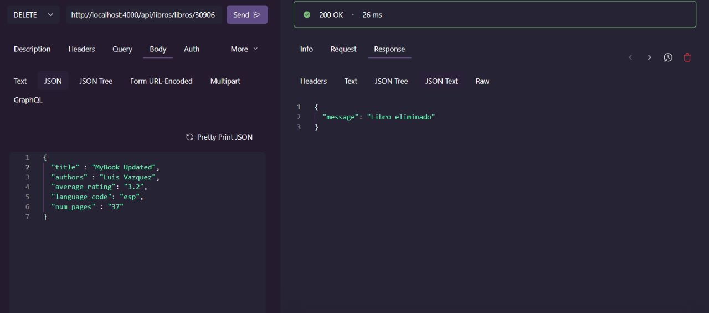
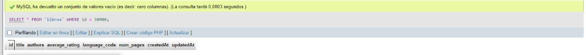

# API usando NodeJS y Express conectado a MySQL usando un ORM (Sequelize)

## Instalación
<pre><code> npm install </code> </pre>
para instalar las dependencias del proyecto

## Configuración
En el archivo config.json se encuentra la configuración de la base de datos, en este caso se usa MySQL, pero se puede cambiar por cualquier otro motor de base de datos que soporte Sequelize.

## Consultas Disponibles

* ### GET /api/libros [http://localhost:4000/api/libros](http://localhost:4000/api/libros)
    Le da una bienvenida al usuario
    
* ### GET /api/libros/libros [http://localhost:4000/api/libros/libros](http://localhost:4000/api/libros/libros)
    Obtiene todos los libros de la base de datos y los muestra en formato JSON
    
* ### GET /api/libros/libro/:id
    Obtiene un libro de la base de datos y lo muestra en formato JSON
    
* ### POST /api/libros/libros
    Crea un nuevo libro en la base de datos y lo muestra en formato JSON
    
    
    * **Nota:** Para crear un libro se debe enviar un JSON con los siguientes datos:
    ```json
    {
        "title" : "El nombre del libro",
        "authors" : "El nombre del autor o autores",
        "average_rating": "El promedio de calificación",
        "language_code": "El código del idioma",
        "num_pages" : "El número de páginas"
    }
    ```
    Si se envía un JSON con datos incorrectos, se mostrará un mensaje de error
    
* ### PUT /api/libros/libro/:id
    Actualiza un libro de la base de datos y si se actualiza correctamente muestra un mensaje de éxito
    
    
    * **Nota:** Para actualizar un libro se debe enviar un JSON con los siguientes datos:
    ```json
    {
        "title" : "El nombre del libro",
        "authors" : "El nombre del autor o autores",
        "average_rating": "El promedio de calificación",
        "language_code": "El código del idioma",
        "num_pages" : "El número de páginas"
    }
    ```
* ### DELETE /api/libros/libro/:id
    Elimina un libro de la base de datos y si se elimina correctamente muestra un mensaje de éxito
    
    

## Sobre el Proyecto
El proyecto fue creado con NodeJS y Express, y se conecta a una base de datos MySQL usando Sequelize como ORM.

El proyecto corre en el puerto 4000, por lo que para probarlo se debe usar la siguiente URL: http://localhost:4000/api/libros, pero se puede cambiar el puerto en la variable de entorno <pre><code>PORT=Puerto_deseado</code> </pre>

## Autor
Luis Manuel Vazquez Fierros